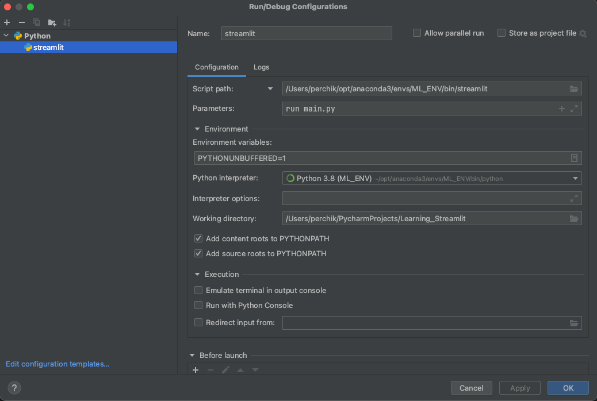

# Learning Streamlit

## Config in PyCharm



### Imports

```python
import streamlit as st
import pandas as pd
import numpy as np
import matplotlib.pyplot as plt
import time
```

## write

```python
st.write("## Here's our first attempt at using data to create a table:")
    st.write(pd.DataFrame({
        'first column': [1, 2, 3, 4],
        'second column': [10, 20, 30, 40]
    }))
```

## Display Data

```python
st.dataframe(dataframe)
    st.table(dataframe)
    chart_data = pd.DataFrame(
        np.random.randn(20, 3),
        columns=['a', 'b', 'c'])
    st.line_chart(chart_data)

    map_data = pd.DataFrame(
        np.random.randn(1000, 2) / [50, 50] + [37.76, -122.4],
        columns=['lat', 'lon'])
    st.map(map_data)
```

## Widgets

```python
x = st.slider('x')  # 👈 this is a widget
st.write(x, 'squared is', x * x)

x = st.button('x')  # 👈 this is a widget

x = st.checkbox('x')  # 👈 this is a widget

st.text_input("Your name", key="name")

# You can access the value at any point with:
st.write(f'The name is {st.session_state.name}')
```

## Checkbox

```python
if st.checkbox('Show dataframe'):
    chart_data = pd.DataFrame(
        np.random.randn(20, 3),
        columns=['a', 'b', 'c'])
    st.write(chart_data)
```


## Layout 

```python
left_column, right_column = st.columns(2)
# You can use a column just like st.sidebar:
left_column.button('Press me!')
with left_column:
    fig, ax = plt.subplots()
    ax.plot([1, 2, 3], [1, 10, 5])
    st.pyplot(fig)

# Or even better, call Streamlit functions inside a "with" block:
with right_column:
    chosen = st.radio(
        'Sorting hat',
        ("Gryffindor", "Ravenclaw", "Hufflepuff", "Slytherin"))
    st.write(f"You are in {chosen} house!")
```

## Progress Bar

```python
'Starting a long computation...'

# Add a placeholder
latest_iteration = st.empty()
bar = st.progress(0)

for i in range(100):
    # Update the progress bar with each iteration.
    latest_iteration.text(f'Iteration {i + 1}')
    bar.progress(i + 1)
    time.sleep(0.1)

'...and now we\'re done!'
```

## Cache

```python
@st.cache
def slow_func():
    # Add a placeholder
    latest_iteration = st.empty()
    bar = st.progress(0)
    for i in range(100):
        # Update the progress bar with each iteration.
        latest_iteration.text(f'Iteration {i + 1}')
        bar.progress(i + 1)
        time.sleep(0.1)
```

## Pages

Add folder 'pages'.

Insert there more `.py` files.

Done.


## Credits

- [forum | Rum Streamlit from PyCharm](https://discuss.streamlit.io/t/version-1-5-0/21455/11)
- [st | API Reference](https://docs.streamlit.io/library/api-reference)
- [st | Main Concepts](https://docs.streamlit.io/library/get-started/main-concepts)
- [st | session state, callbacks](https://docs.streamlit.io/library/api-reference/session-state#use-callbacks-to-update-session-state)